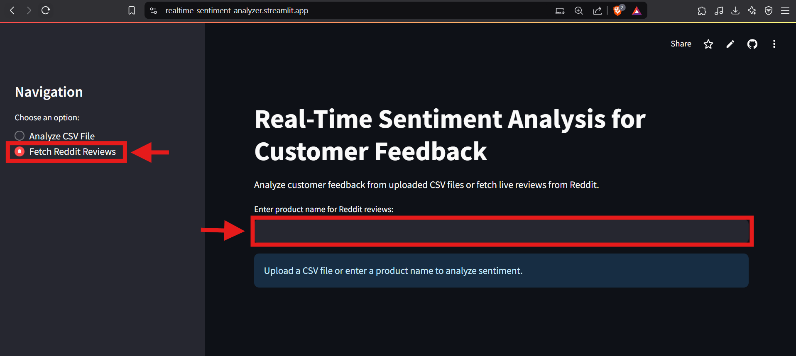
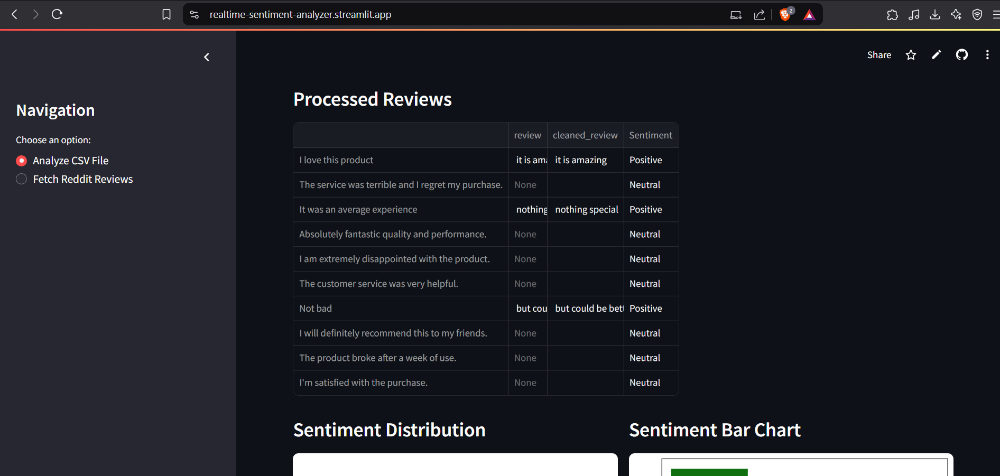
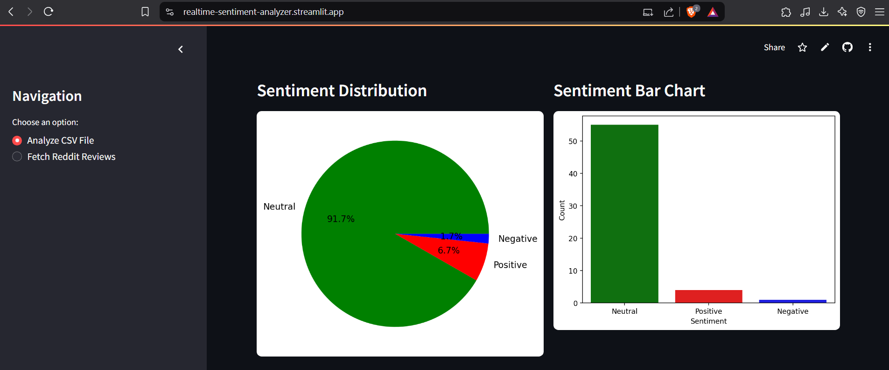
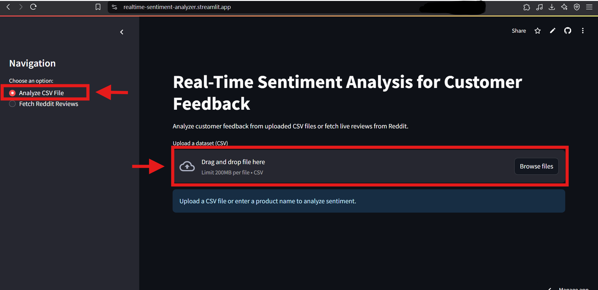
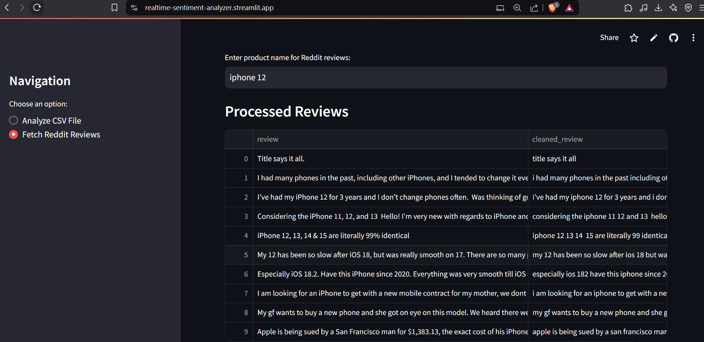
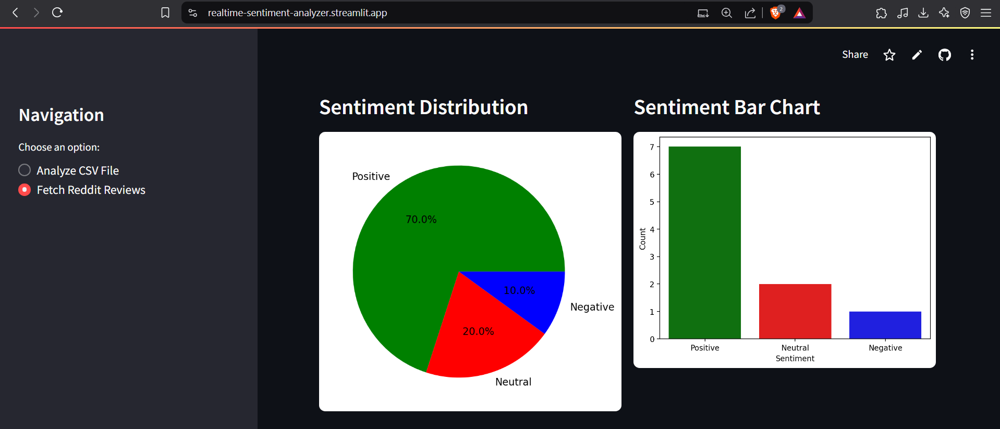
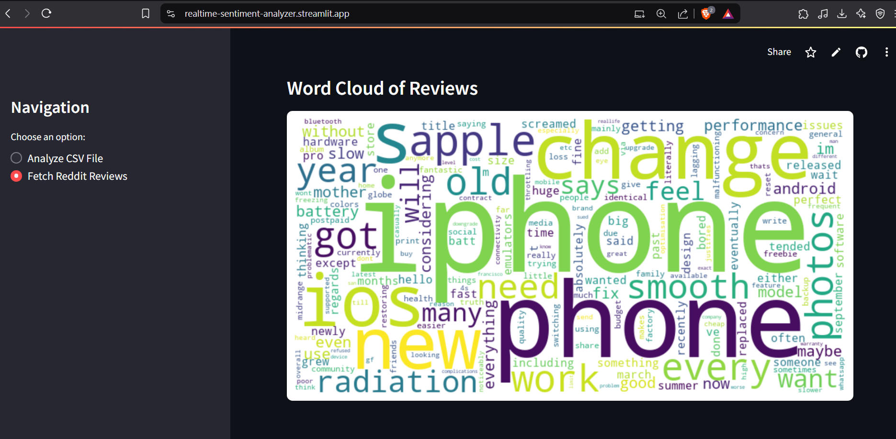

# Real-Time Sentiment Analysis for Customer Feedback

This project is a Streamlit-powered web application that enables users to analyze customer sentiments. Users can upload a CSV file containing customer reviews or fetch live discussions from Reddit. The application cleans and preprocesses the text, performs sentiment analysis using TextBlob, and provides interactive visualizations including sentiment distribution charts and word clouds.

---

## Features

- **CSV File Analysis:**  
    Upload a CSV file containing customer reviews. The app automatically cleans the text and classifies it into Positive, Negative, or Neutral sentiment.

- **Live Reddit Reviews:**  
    Fetch live discussions from Reddit based on a given product name. The app processes and analyzes the results in real time.

- **Interactive Visualizations:**  
    - **Data Table:** Displays the processed reviews.
    - **Pie Chart:** Visualizes sentiment distribution.
    - **Bar Chart:** Provides comparative sentiment counts.
    - **Word Cloud:** Highlights the most frequent terms in the reviews.

- **Customizable UI:**  
    The app features a clean, configurable interface with custom theming.

---

## Project Structure

```
Sentiment-Analysis-Project/
├── app.py                  # Main Streamlit application
├── scraper.py              # Module for fetching Reddit reviews using PRAW
├── preprocess.py           # Module for text cleaning and preprocessing
├── sentiment_analysis.py   # Module for sentiment analysis using TextBlob
├── visualization.py        # (Optional) Module for additional visualizations
├── models/
│   └── sentiment_model.pkl # (Optional) Pre-trained sentiment model
├── data/
│   ├── customer_review.csv # Sample CSV with raw customer reviews
│   └── cleaned_reviews.csv # Sample CSV with processed reviews and sentiments
├── notebook/
│   └── sentiment_analysis.ipynb # (Optional) Jupyter Notebook for exploration
├── .env                    # Environment variables for secrets (gitignored)
├── .gitignore              # Specifies files to exclude from version control
└── requirements.txt        # List of dependency packages
```

---

## Prerequisites

- Python 3.7 or later
- `pip` package manager

---

## Installation

1. **Clone the Repository:**

        ```
        git clone https://github.com/darshanbagade/SITNovate.git
        cd SITNovate/Sentiment-Analysis-Project
        ```

2. **Create & Activate a Virtual Environment (Recommended):**

    On Windows:
    ```
        python -m venv venv
        venv\Scripts\activate
    ```

    On macOS/Linux:
    ```
        python3 -m venv venv
        source venv/bin/activate
    ```

3. **Install Dependencies:**

    ```
        pip install -r requirements.txt
    ```

4. **Download TextBlob Corpora:**

     ```
        python -m textblob.download_corpora
    ```

---

## Configuration

The application uses environment variables to store Reddit API credentials. These are loaded from the `.env` file.

An example `.env` configuration:

```ini
REDDIT_CLIENT_ID=your_client_id
REDDIT_CLIENT_SECRET=your_client_secret
REDDIT_USERNAME=your_username
REDDIT_PASSWORD=your_password
REDDIT_USER_AGENT=your_user_agent
```

Note: The `.env` file is gitignored (`.gitignore`) to prevent these secrets from being committed to the repository. For deployments (e.g., on Streamlit Cloud), add these secrets via the platform’s Secrets Management.

---

## Usage

1. **Run the Application**

    From the root of the Sentiment-Analysis-Project directory, execute:
    `streamlit run app.py`

2. **Interacting with the App**

   - **Analyze CSV File:**  
    Upload your CSV file with a review column. The app processes and displays the data along with sentiment analysis results.

   - **Fetch Reddit Reviews:**  
    Enter a product name to fetch live reviews from Reddit. The fetched data is cleaned and analyzed, then visualized using interactive charts.

---

## Sample Data

### **customer_review.csv** (Located in `data/`)

| review |
|------------------------------------------------------|
| "I absolutely love this product! It has changed my life." |
| "Worst purchase ever. The product broke within a week."   |
| "It was okay, nothing spectacular but did the job."       |

### **cleaned_reviews.csv** (Located in `data/`)

| review | cleaned_review | Sentiment |
|------------------------------------------------------|----------------------------------------------------------|-----------|
| "I absolutely love this product! It has changed my life." | "i absolutely love this product it has changed my life" | Positive  |
| "Worst purchase ever. The product broke within a week."   | "worst purchase ever the product broke within a week"   | Negative  |
| "It was okay, nothing spectacular but did the job."       | "it was okay nothing spectacular but did the job"       | Neutral   |

---

## <u>Deployment :</u>

- **Streamlit Cloud:**
    - Push your repository to GitHub.
    - Deploy the project on Streamlit Cloud.
    - Add your environment secrets via Streamlit Cloud's Secrets Management settings.

---

## <u>Screenshots:</u>
## 1. Get Review Sentiment through CSV File

1. Choose **Analyze CSV File**
2. Upload CSV File
3. Enter



### **Result:**




---

## 2. Get Review Sentiment through Product Name

1. Choose **Fetch Reddit Reviews**
2. Enter Product Name 
3. Enter



### **Result:**





## <u>License</u>

This project is open-source and available under the MIT License.

---

## <u>Acknowledgments:</u>

- Streamlit for providing a powerful, user-friendly framework for interactive applications.
- PRAW for simplifying Reddit API integration.
- TextBlob for straightforward sentiment analysis.
- Contributions from the open-source community.

Feel free to modify any details before publishing your repository. 🚀